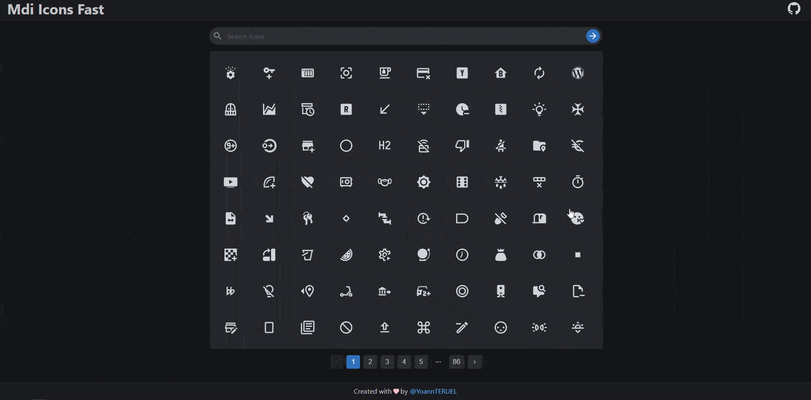

# Mdi Icons Fast

[](https://twitter.com/YoannTeruel)



> Mdi Icons search engine. Faster than the [original](https://materialdesignicons.com).
> Searching icons with the original website is really waste of time because this website is very laggy...
> So I've decided to build my own search engine.

### 🎉 [Mdi Icons Fast](https://mdi-icons-fast.herokuapp.com/)

## Prerequisites

- PostgresSQL database

## Install

```sh
npm install
```

Do this command for the api too. The api source code is located in > `src/api`

## Environment variable

### Front

```
REACT_APP_API_URL
```

### Back

```
DATABASE_URL
```

## Usage

### Run the front

```sh
npm run react:start
```

### Run the back (src/api)

Execute migration

```sh
npx prisma migrate deploy
```

Execute seeder

```sh
npx prisma db seed
```

Execute the app

```sh
npm run start
```

## 🤝 Contributing

Contributions, issues and feature requests are welcome!<br />Feel free to
check [issues page](https://github.com/yteruel31/mdi-icons-fast/issues).

## Show your support

Give a ⭐️ if this project helped you!
